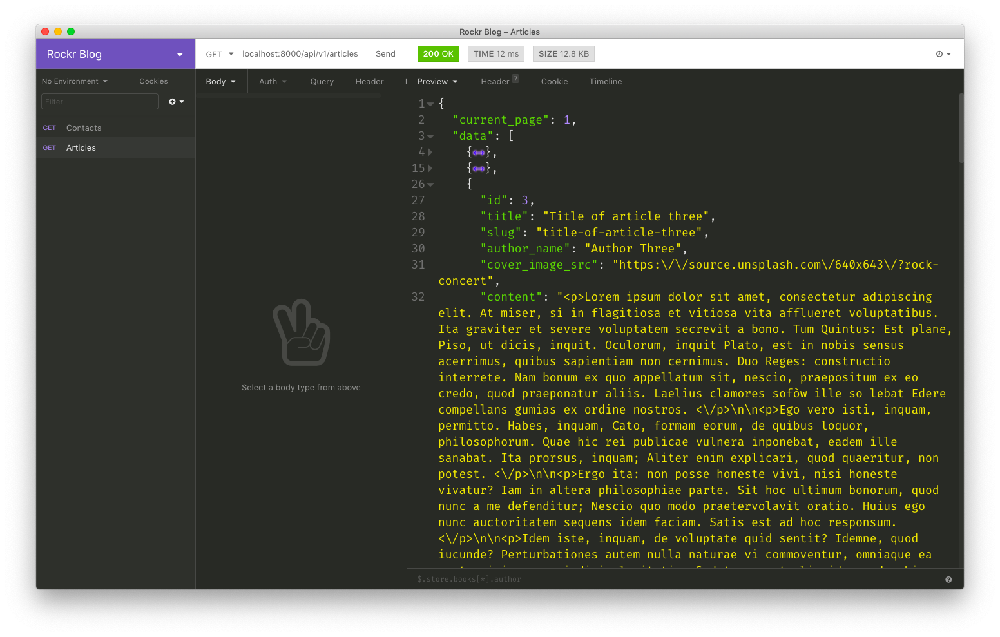
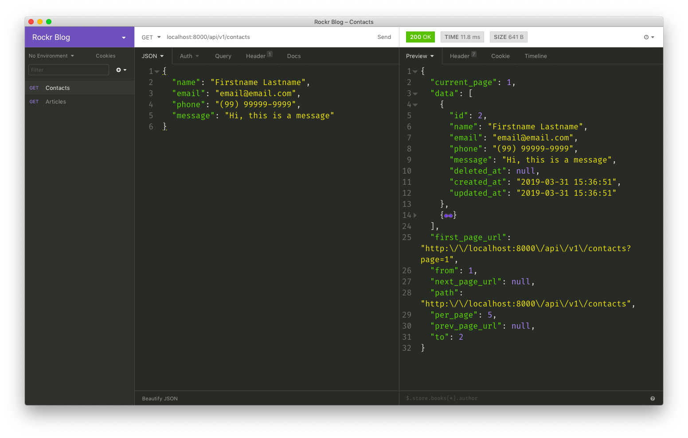

# Rockr Blog API

Uma API REST feita (em alguns minutos) com PHP utilizando o micro-framework [Lumen](https://lumen.laravel.com) e MySQL para integrar artigos e contatos.

## Instalação

1. Crie um banco de dados (MySQL):

```sql
create database rockr_blog;
```

2. Faça o download do projeto: 

```bash
git clone https://github.com/ahlechandre/rockr-blog-api.git
```

3. Acesse o direitório:

```bash
cd rockr-blog-api
```

4. Instale as dependências:

```bash
composer install
```

5. Crie o arquivo de ambiente, gere uma chave randômica e copie-a para *clipboard*:


```bash

cp .env.example .env && php -r "require 'vendor/autoload.php'; echo base64_encode(str_random(32)).PHP_EOL;"

# dXFpemwxQTF1Y1F4TTk4RnVKeXdwTVRidFFRMGlYQnQ=
```

6. Abra o arquivo `.env`:

```bash
vim .env
```

7. Associe manualmente a sua chave ao índice `API_KEY` e configure a conexão com o banco de dados:

```dotenv
APP_KEY=dXFpemwxQTF1Y1F4TTk4RnVKeXdwTVRidFFRMGlYQnQ=

DB_DATABASE=rockr_blog
DB_USERNAME=root
DB_PASSWORD=root
```

8. Rode as migrations e os seeders:

```bash
php artisan migrate --seed
```

9. Inicie o servidor na porta `8000` (de preferência):


```bash
php -S localhost:8000 -t public
```

10. Teste a API:

```bash
curl localhost:8000/api/v1/articles/1
```

## REST Endpoints

| Método | Rota | Descrição |
|--------|------|----------|
| `GET` | `/api/v1/articles` | Lista os recursos da coleção paginada de **artigos**.
| `GET` | `/api/v1/articles/{id}` | Mostra um único recurso de **artigo**.
| `GET` | `/api/v1/contacts` | Lista os recursos da coleção paginada de **contatos**.
| `POST` | `/api/v1/contacts` | Armazena um novo recurso na coleção de **contato**.

#### Formato para adicionar contato

```json
{
  "name": "Firstname Lastname",
  "email": "email@email.com",
  "phone": "(99) 99999-9999",
  "message": "Hi, this is a message"
}
```

## Screenshots

1. Demostração de API para artigos:



2. Demonstração de API para contatos:



## Third-party libraries

* `barryvdh/laravel-cors`
  - Por quê: manipular requisições *Cross-Origin Resource Sharing* (CORS) com método HTTP `OPTIONS`.
  - Como: adicionado globalmente para todas as rotas.

--------

*Made with love*.